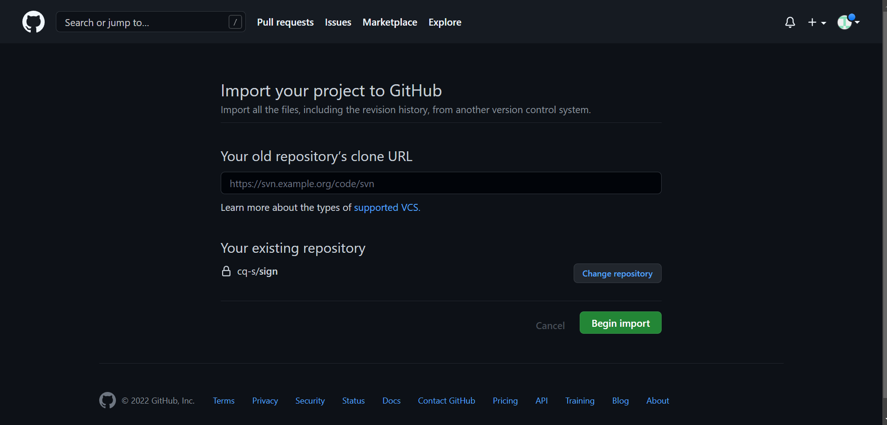
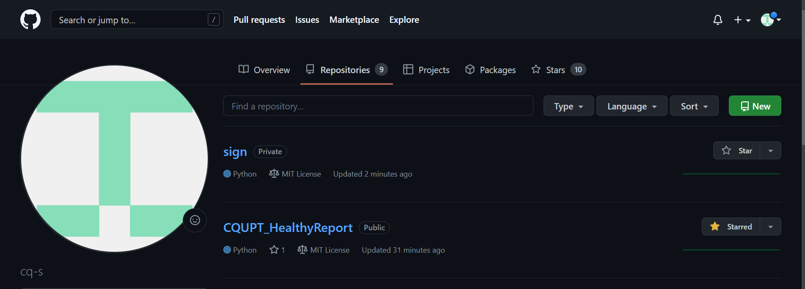
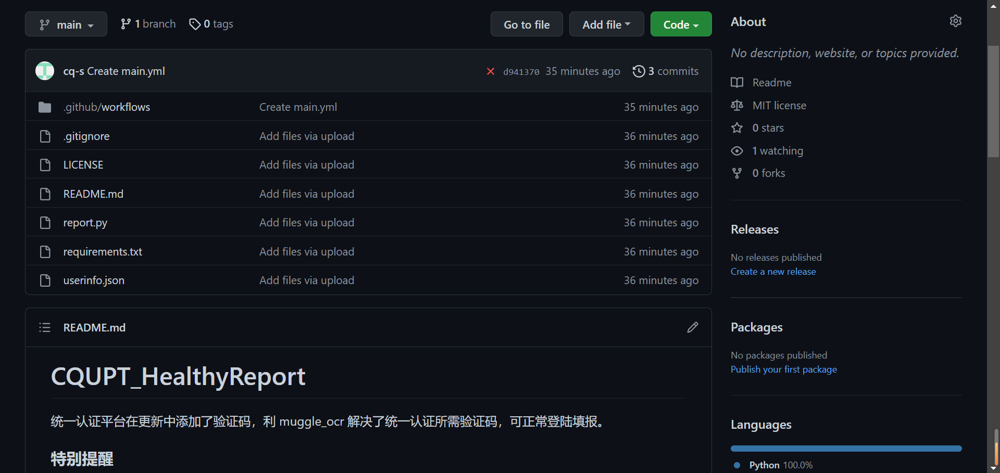
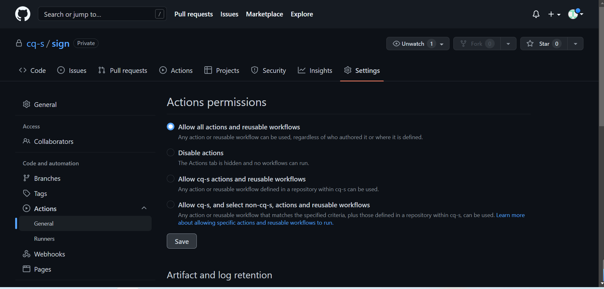

# CQUPT_HealthyReport

统一认证平台在更新中添加了验证码，利用 muggle_ocr 解决了统一认证所需验证码，可正常登陆填报(目前平台已不再需要验证码，当使用Github Actions 云端运行且需要验证码时请复制`main-ocr.yml`中的内容：替换 .`github/workflows-main.yml`中的所有内容)。

### 特别提醒

这里仅技术论证了健康日报的单次自动提交功能，一定程度上可以节约**身体健康的同学**填报健康日报的时间，但**请不要隐瞒自己的健康状况！**

**如果有特殊情况，请立即停用并修改当天记录为实际情况！**

**因隐瞒自身健康状况导致的一切后果，本项目一概不负责！**
 
### **云端部署警告**

如果你需要将项目部署至 Github Actions 云端运行，请务必将仓库属性设置为**私有**!否则你的统一认证账号可能泄露。

由于相关库过多造成依赖文件大于云函数所允许的最大值目前可能无法使用(需要验证码时)。

当不需要验证码进行验证登录时将`report.py`中的内容替换到云函数的`index.py`,同时填写`userinfo.json`上传并安装`requirements.txt`中的依赖即可

默认执行时间设置在北京时间7:00（GitHub使用UTC时间，应为23:00），则设置corn触发的表达式为: `00 23 * * *`  如需修改可前往：.github/workflows-main.yml-schedule修改corn表达式

特别注意：(由于 Github Actions 的校时有误差,在设定时间的前后半小时均为正常现象)。

### 使用方式
#### 方式一
> (使用Github Actions)
---
1.登录自己的GitHub账号后点击右上角的`Star`

---


---
2.创建新仓库[点击创建自己的仓库](https://github.com/new/import)

---
3.在`Your old repository’s clone URL`处填入
```
https://github.com/cq-s/CQUPT_HealthyReport
```
---
4.然后在`Repository name`处填写仓库名,随便填，例如`sign`，选择`Private`

---
5.最后点击最下方的`Begin import`，等待导入完成。

---


---
6.再次点击右上角的头像选择 `Your repositories`
找到刚才导入的项目，填写`userinfo.json`文件即可(填写说明见方法二第三步),如需修改时间请按`云端部署警告`中的说明进行修改。

---


---


---
7.在`settings`中选择`Actions`>  `General`>`Allow all actions and reusable workflows`，最后点击`save`保存即可。

---

#### 方式二(本地或服务器运行,配合定时计划使用)
> 建议 Python 版本 >= 3.6
---
1.下载文件(或者直接下载)
```
git clone https://github.com/cq-s/CQUPT_HealthyReport.git
```
---
2.安装依赖
```
pip3 install -r requirements.txt
```
 (当需要验证识别时请使用)
 ```
 pip3 install -r requirements-ocr.txt
 ```
---
3.填写`userinfo.json`文件
```json
[
#第一个用户的信息
{"username":"",---7位统一认证码
"password":"",---登录教务系统的密码
"email":"" },---自己的邮箱地址，用于接收打卡完成通知，不需要可留空
#第二个用户的信息
{"username":"",
"password":"",
"email":""}
]

注：需要几个用户就添加几个字典，最后一个用户信息后没有`,`
```

4.直接运行

```
python3 report.py
```
(当需要验证识别时请使用)
 ```
  python report-ocr.py
 ```
---


